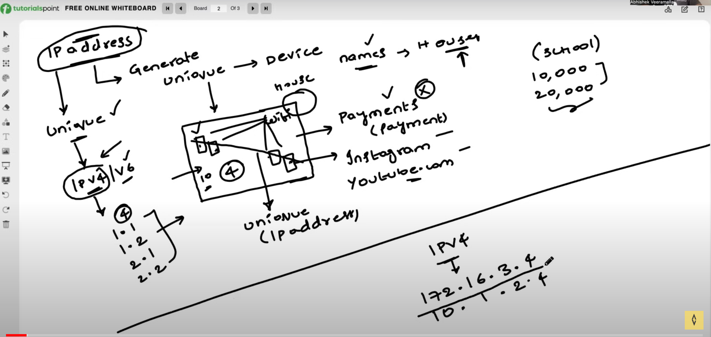

# IP Address



IP address is a unique identifier assigned to each device connected to a network. It is used to identify
and locate devices on a network. IP addresses are typically written in a "dotted decimal" notation
consisting of four numbers separated by dots, each ranging from 0 to 255.

```
192.168.1.255
```

### IPV4
IPV4 is the fourth version of the Internet Protocol. It is the most widely used version of the Internet Protocol. IPV4 uses 32-bit addresses, which allows for a maximum of 2 (4,294,967,296) unique addresses.


### Why only range from 0 to 255
The reason why IP addresses only range from 0 to 255 is because each part of the IP address is represented by 8 bits (or 1 byte). Since each bit can have a value of either 0 or 1, the maximum value that can be represented by 8 bits is 2^8 = 256. Therefore, the range of each part of the IP address is 0 to 255.

```
--------|--------|--------|--------

192.0.0.0.

11000000|00000000|00000000|00000000

```
