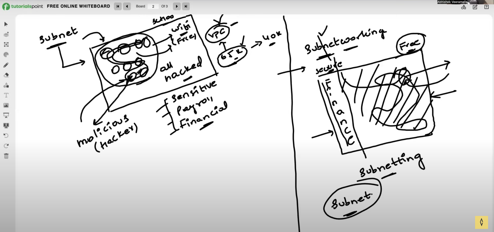

# Subnet

- Privacy
- Security
- Isolation

### Private Subnet
- No direct access to the internet
- No public IP address
- Only accessible from within the VPC
- Used for databases, file servers, etc.

### Public Subnet
- Direct access to the internet
- Public IP address
- Accessible from the internet
- Used for web servers, load balancers, etc.

### CIDR