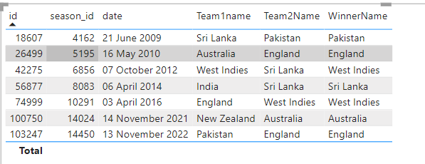

# Fetch text values using USERELATIONSHIP


## We have two tables 
- Matches
- Teams

### Exploring DAX: Understanding the Team2Name Calculation
```DAX
Team2Name = IF(
    HASONEVALUE(matches[team_2_id]),
    CALCULATE(
        CALCULATE(
            VALUES(teams[name]), matches),
            USERELATIONSHIP(teams[id], matches[team_2_id]),
        ALL(teams)
    )
)
```

### In this DAX expression, we're defining a calculated column called Team2Name. Let's break it down:

- **IF Statement:** We begin with an IF statement to check if there is only one value in the team_2_id column of the matches table.

- **CALCULATE Function:** If there's only one value in team_2_id, we use CALCULATE to modify the context of the calculation.

- **Nested CALCULATE Function:** Inside the first CALCULATE, we have another CALCULATE function. This is where the actual calculation takes place.

- **VALUES Function:** We're using VALUES(teams[name]) to retrieve the distinct values of the name column from the teams table.

- **USERELATIONSHIP Function:** Here, we specify a relationship between the teams table and the matches table based on their respective columns (id and team_2_id). This allows us to filter the teams table based on the current row context in matches.

- **ALL Function:** Finally, we use ALL(teams) to remove any filters applied to the teams table, ensuring that we get the correct result even when there are additional filters present.

### This DAX expression effectively calculates the name of the team corresponding to the team_2_id in the matches table, considering the relationship between the teams and matches tables.

## Output

